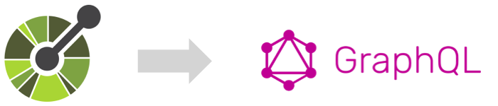
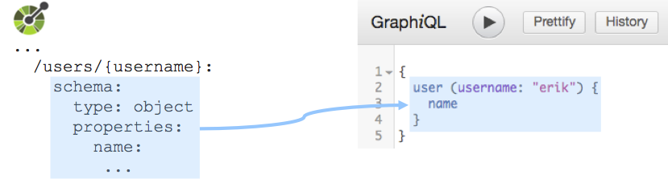
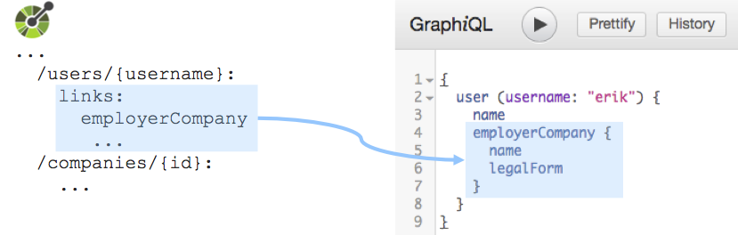
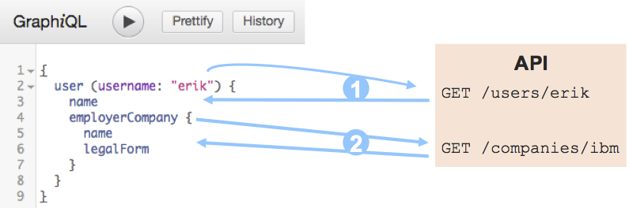
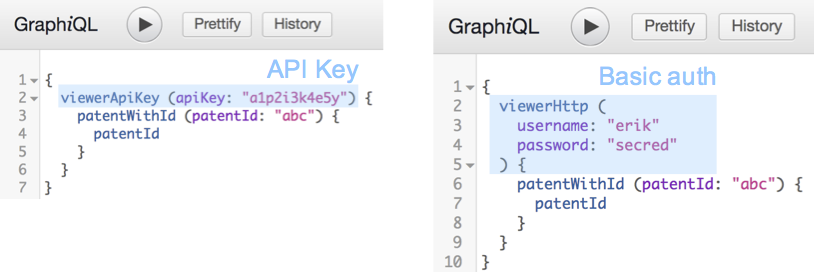

# OASGraph

Turns APIs described by OpenAPI specifications (OAS) into GraphQL interfaces.



## Characteristics

* **Data-centric**
  The GraphQL interface is created around the data definitions in the given OAS, not around the endpoints, leading to a natural use of GraphQL.
  
  

* **Nested data**
  [Links](https://github.com/OAI/OpenAPI-Specification/blob/OpenAPI.next/versions/3.0.md#linksObject) defined in the OAS are used to compose data definitions.
  
  

* **Automatic query resolution**
  Automatically generated resolvers translate (nested) GraphQL queries to API requests. Request results are translated back to GraphQL responses.
  
  

* **Mutations**
  Non-safe, non-idempotent API operations (e.g., `POST`, `PUT`, `DELETE`) are translated to GraphQL [mutations](http://graphql.org/learn/queries/#mutations). Input payload is type-checked.
  
  

* **Authentication**
  OASGraph currently supports authentication via API Key and basic auth. OASGraph wraps secured endpoints into a `viewer`, which takes the API key / credentials as input.

  

* **API Sanitation**
  Parts of an API that not compatible with GraphQL are automatically sanitized. For example, API parameters and data definition names with unsupported characters (e.g., `-`, `.`, `,`, `:`, `;`...) are sanitized.

* **Custom request options** Provide headers and query parameters to send with every API request. This allows, for example, to handle authentication or tag requests from GraphQL.

## Work in progress

- [x] Handle arrays
- [x] Enable mutating operations (POST, PUT, DELETE...)
- [ ] Compose multiple OAS
- [ ] Handle authentication
- [ ] Translate Swagger/OAS 2.0 automatically


## Usage
Install this package. Then, simply pass it an OpenAPI Specification 3.0. The library returns a promise:

```javascript
const OASGraph = require('oasgraph') // use real name here

let oas = require('./example_oas.json') // or other means of obtaining the OAS

OASGraph.createGraphQlSchema(oas)
  .then(schema => {
    // do something with the schema
  })
  .catch(err => {
    // handle errors when creating the schema
  })
```

You can then use the generated schema, for example to be served using [Express.js](http://expressjs.com/):

```javascript
const express = require('express')
const graphqlHTTP = require('express-graphql')
const OASGraph = require('oasgraph') // use real name here
const app = express()

OASGraph.createGraphQlSchema(oas)
  .then(schema => {
    app.use('/graphql', graphqlHTTP({
      schema: schema,
      graphiql: true
    }))
    app.listen(3001)
  })
  .catch(err => {
    // handle errors when creating the schema
  })
```


## Options
OASGraph allows to define an optional `options` object:

```javascript
OASGraph.createGraphQLSchema(oas, options)
```

The following options can be set:

* `headers` (type: `object`, default: `{}`): Headers to be sent in every request. Parameters defined in the OpenAPI Specification to set these headers will be ignored by OASGraph.

* `qs` (type: `object`, default: `{}`): Query parameters to be sent in every request. Parameters defined in the OpenAPI Specification to set these query parameters will be ignored by OASGraph.


## Testing
To test OASGraph, first make sure the example API server is running:

```bash
node test/example_api_server.js
```

Then, run tests:

```bash
npm test
```


## Similar projects

* [swagger-to-graphql](https://github.com/yarax/swagger-to-graphql) turns a given Swagger (OpenAPI Specification 2.0) into a GraphQL interface, which resolves against the original API. GraphQL schema is based on endpoints, not on data definitions. No links are considered.

* [json-to-graphql](https://github.com/aweary/json-to-graphql) turns given JSON objects / arrays into a GraphQL schema. `resolve` functions need to be provided by the user.

* [StackOverflow discussion](https://stackoverflow.com/questions/38339442/json-schema-to-graphql-schema-converters) points to the above projects.
