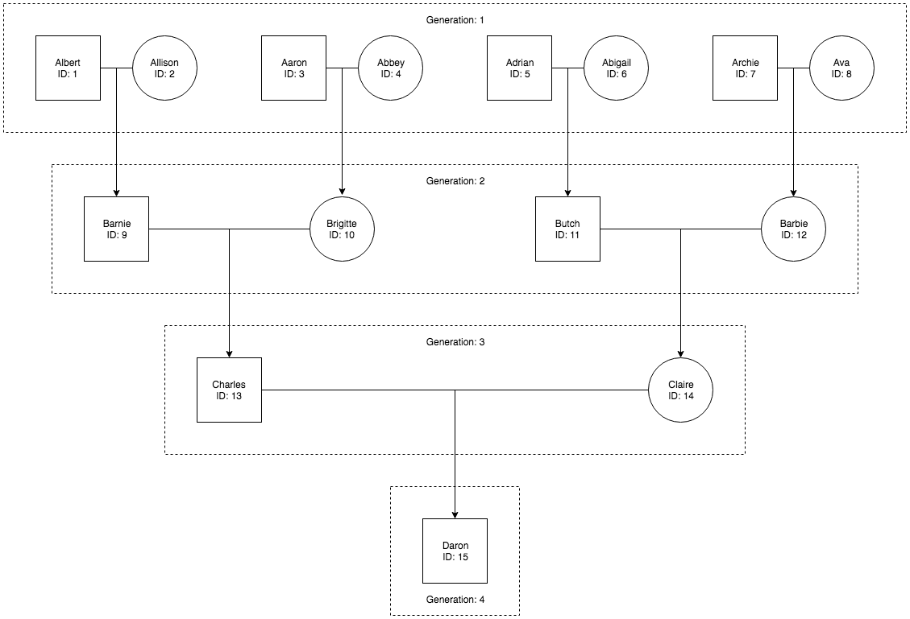

# LoopBack and OASGraph tutorial

The purpose of this tutorial is to give an in-depth look into using OASGraph together with LoopBack v4.

We will use a pre-made API created with LoopBack v4 to describe how OASGraph can be used on said API and what OASGraph will do to the API in order to produce a GraphQL interface. In addition, we will describes the steps needed to change the OAS to get the most out of the produced GraphQL interface.

### Clone LoopBack API

OASGraph will create a GraphQL interface that will resolve on, or query, an API.

In this tutorial we will be providing a LoopBack API, the [Example Family Tree API](https://github.com/strongloop/loopback4-example-family-tree), that you can run locally. The purpose of this API is to not only showcase the compatibility between LoopBack and OASGraph but also to demonstrate the capabilities of OASGraph.

***

To clone the Example Family Tree API, follow the proceeding steps.

```
git clone git@github.com:strongloop/loopback4-example-family-tree.git
cd loopback4-example-family-tree
npm i
```

***

To give some background, the Example Family Tree API simulates the relationship between parent and child. There is only one model in this API, the **Person** model, and here is what it looks like:

```
Person {
	id : number
	name : String
	generation: number
	motherId : number
	fatherId : number
}
```

In addition, the API is preloaded with some data that we will query for. Here is what the data looks like:



### Save OAS

Start the API by running the following:

```
# in the LoopBack project folder:
npm start
```

Next, access the API's OAS at [http://127.0.0.1:3000/openapi.json](http://127.0.0.1:3000/openapi.json) and save it to disk.

Then change the server url to match the following. Otherwise, the GraphQL interface will not be able to make calls to the Example Family Tree API.

```
"servers": [
  {
    "url": "http://localhost:3000"
  }
]
```

### Install OASGraph

To install OASGraph, clone the repository and link the library (for the CLI commands to work) using the indicated steps.

```
npm i -g oasgraph
```

Please note that OASGraph can be used either as a library, or via its Command Line Interface (CLI). In this case, we will be using the CLI tool, which will start a server in addition to creating the GraphQL interface.

### Start GraphQL server

Start the GraphQL server by running the following command.

```
oasgraph <OAS JSON file path or remote url>
```

The created GraphQL server is then accessible at [http://127.0.0.1:3001/graphql](http://127.0.0.1:3001/graphql).

### Try simple queries

Congratulations! You have created your first GraphQL interface with OASGraph.

We can explore the GraphQL interface through the [GraphiQL IDE](https://github.com/graphql/graphiql) that will show at the previously provided link.

Try to run a simple query like the following:

GraphQL query
```
query{
  person(id: 15){
    name
  }
}
```

Expected output
```
{
  "data": {
    "person": {
      "name": "Daron"
    }
  }
}
```

***

Although this is a fully-fledged GraphQL interface, we can still improve it.

For instance, this GraphQL interface does not provide nested queries. Recall that the **Person object** also stores the *motherId* and *fatherId* which can be used to query other **People**. In GraphQL, we can make it so that a user can query the mother and father objects from within the child object. To do so, we will need to make slight additions to the OAS, which will be discussed in the following sections.

For now, in the *Documentation Explorer* on the right hand side, click **Query** and then the return type, **Person**, in ```person(id: Float!): person```. Note that the **Person** object can only return the following fields. With our nested query changes, we will see new fields that will let us query the mother and father objects.

```
id: Float
name: String
generation: Float
motherId: Float
fatherId: Float
```

### Adding links

[Link objects](https://github.com/OAI/OpenAPI-Specification/blob/master/versions/3.0.1.md#linkObject "Link object documentation") are constructs in OAS that allow you to explicitly define relationships between different models and operations. For example, when you query for a **Person**, you will receive a *motherId* and a *fatherId*, which can be used to query for other **People**. When you have actions that naturally lead to the next, you use **Link objects** to describe this flow.

While **Link objects** (and OAS in general) are useful for documenting APIs, links are especially important for OASGraph. Even though OASGraph can wrap any API with a valid OAS, it needs **Link objects** in order to create GraphQL interfaces that can conduct the powerful nested queries they are famous for. If we try to use the OAS now, the GraphQL interface OASGraph will create will only be able to handle simple queries that are no different than the ones the original API is capable of. Luckily, **Link objects** are easy to define.

***

Here are the **Link objects** we will be adding to the OAS.

```
"links": {
  "mother": {
    "operationId": "getPerson",
    "parameters": {
      "id": "$response.body#/motherId"
    }
  },
  "father": {
    "operationId": "getPerson",
    "parameters": {
      "id": "$response.body#/fatherId"
    }
  }
}
```

Open the Family Tree API OAS and add the *links* and the *operationId* "getPerson" to match the following structure.

```
{
  "paths": {
    "/people/{id}": {
      "get": {
        "operationId": "getPerson"
        "responses": {
          "200": {
            "links": {
              ...
            },
          ...
          },
        ...
        },
        ...
      },
      ...
    },
    ...
  },
  ...
}
```

After you have saved your changes to the OAS, restart the GraphQL server.

```
oasgraph <OAS JSON file path or remote url> 
```

### Try complex queries

In the *Documentation Explorer*, click **Query** and then the return type, **Person**, in ```person(id: Float!): person```.

You should see the following fields.

```
id: Float
name: String
generation: Float
motherId: Float
fatherId: Float
mother: person
father: person
```

Note that there are two new fields, *mother* and *father*. These are from the links we just added to the OAS and will allow us to write nested queries.

Now we can write much complex queries like the following.

GraphQL query
```
query{
  person(id: 15){
    name
    generation
    father{
      name
      id
      generation
      mother{
        name
        id
        generation
        father{
          name
          id
          generation
        }
      }
    }
  }
}
```

Expected output
```
{
  "data": {
    "person": {
      "name": "Daron",
      "generation": 4,
      "father": {
        "name": "Charles",
        "id": 13,
        "generation": 3,
        "mother": {
          "name": "Brigitte",
          "id": 10,
          "generation": 2,
          "father": {
            "name": "Aaron",
            "id": 3,
            "generation": 1
          }
        }
      }
    }
  }
}
```

***

GraphQL query
```
query{
  person(id: 15){
    mother{
        mother{
          mother{
            name
          }
          father{
            name
          }
        }
        father{
          mother{
            name
          }
          father{
            name
          }
        }
      }
    father{
      mother{
        mother{
          id
        }
        father{
          id
        }
      }
      father{
        mother{
          id
        }
        father{
          id
        }
      }
    }
  }
}
```

Expected output
```
{
  "data": {
    "person": {
      "mother": {
        "mother": {
          "mother": {
            "name": "Ava"
          },
          "father": {
            "name": "Archie"
          }
        },
        "father": {
          "mother": {
            "name": "Abigail"
          },
          "father": {
            "name": "Adrian"
          }
        }
      },
      "father": {
        "mother": {
          "mother": {
            "id": 4
          },
          "father": {
            "id": 3
          }
        },
        "father": {
          "mother": {
            "id": 2
          },
          "father": {
            "id": 1
          }
        }
      }
    }
  }
}
```
