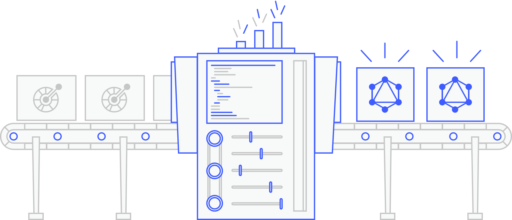
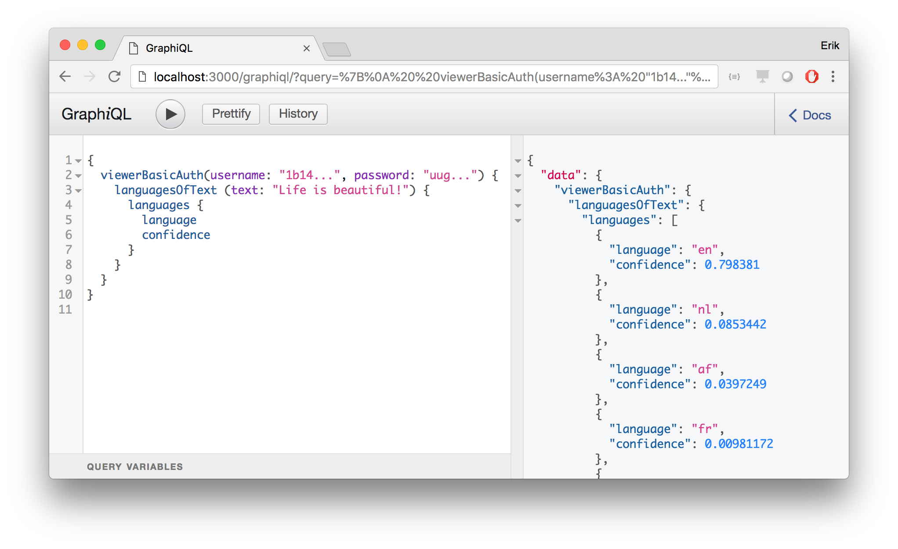
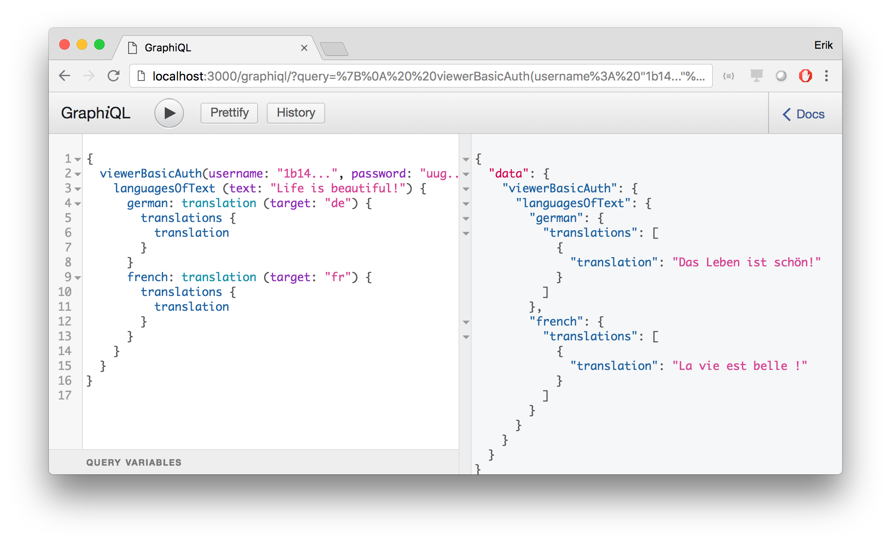

# Generating a GraphQL wrapper for the IBM Watson Language Translator API

OpenAPI-to-GraphQL is a library that automatically creates GraphQL wrappers for existing REST(-like) APIs, relying on the Swagger or OpenAPI specifications of these APIs. To exemplify what OpenAPI-to-GraphQL can do, let's create a GraphQL wrapper for the [IBM Watson Language Translator API](https://www.ibm.com/watson/services/language-translator/). The Language Translator API uses machine learning capabilities to detect the language of given texts, and to translate texts to any of a number of supported languages.

## Video demo

[](https://www.youtube.com/watch?v=87ryTWc85BM "Click here to watch!")

## Creating a simple wrapper

To create a GraphQL wrapper around the API, we use the Swagger specification of the Language Translator API available [here](https://watson-api-explorer.ng.bluemix.net/language-translator-v2.json). From this specification, OpenAPI-to-GraphQL creates a GraphQL schema, consisting of the API's data types and their relations. OpenAPI-to-GraphQL also creates so-called resolve functions, which interact with the Language Translator API to resolve GraphQL queries. The schema created by OpenAPI-to-GraphQL can be exposed using web application frameworks like [Express.js](https://expressjs.com/) via the [express-graphql](https://github.com/graphql/express-graphql) middleware.

The following code shows all that's needed to create and run a GraphQL wrapper around the Language Translator API:

```javascript
const express = require('express')
const graphqlHTTP = require('express-graphql')
const OtG = require('openapi-to-graphql')
const bodyParser = require('body-parser')

async function startServer () {
  // use OpenAPI-to-GraphQL to create a GraphQL schema:
  const oas = require('path/to/language-translator-v2.json')
  const {schema} = await OtG.createGraphQLSchema(oas)

  // setup Express.js app and serve the schema:
  const app = express()
  app.use(bodyParser.json())

  app.use('/', graphqlHTTP({
    schema: schema,
    graphiql: true
  }))

  app.listen(3000)
}

// Kick things off:
startServer()
```

Pretty simple, no?

## Trying out the GraphQL wrapper

Running the above code exposes the created GraphQL wrapper at `localhost:3000`. Visiting `localhost:3000/graphiql`, the well-known GraphiQL in-browser IDE for GraphQL is exposed and allows us to perform first queries, for example to identify the language of a given text:



Note the `viewerBasicAuth` type at the root of this query. It was created by OpenAPI-to-GraphQL as a mechanism for users to provide their [Language Translator API credentials](https://www.ibm.com/watson/developercloud/language-translator/api/v2/curl.html?curl#authentication) as part of the query. If desired, OpenAPI-to-GraphQL can alternatively be configured to send credentials without the user having to explicitly state them. As we can see, the above query returns a list of identified candidate languages of the given text, which are ranked by a confidence score.

## Enabling nested queries

Running simple queries like this one via GraphQL already provides some benefits, because the user can select the specific data _fields_ to be returned, allowing to reduce response sizes. However, arguably, much more value results from GraphQL's ability to perform more complex, nested queries. To enable nested queries, OpenAPI-to-GraphQL makes use of [links](https://swagger.io/docs/specification/links/), a new feature of the OpenAPI Specification 3.0. Links allow to define dependencies between API operations by specifying how data returned by one operation can be used as input to another operation. If present in a given OpenAPI Specification, OpenAPI-to-GraphQL uses links to enrich GraphQL types, allowing deeply nested queries.

To add links, we first convert the Swagger specification of the Language Translator API to an OpenAPI Specification 3.0 using an [online service](https://mermade.org.uk/openapi-converter). We then define a link, which states that the translate operation (labeled as `translateGet`) can set its `source` parameter to the first entry of the list of identified languages (thus, the most likely language of a text). Additionally, the translate operation can set the required `text` parameter to the text used for identifying languages. The following snippet shows our additions to the specification, shown in YAML notation for brevity:

```yaml
...
/v2/identify:
  get:
    responses:
      200:
        links:
          Translation:
            operationId: translateGet
            description: Translates the text from the language identified with the highest confidence.
            parameters:
              source: "$response.body#/languages[0].language",
              text: "$request.body.text"
...
```

Restarting our server with the extended OpenAPI Specification, users can now identify the language of a given text and translate it (to possibly multiple target languages, relying on GraphQL [aliases](https://graphql.org/learn/queries/#aliases)) using a _single query_:



Thus, the above query allows to combine previously three requests to the Watson Language Translator API into a single GraphQL query.
